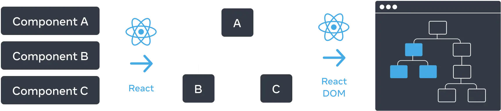
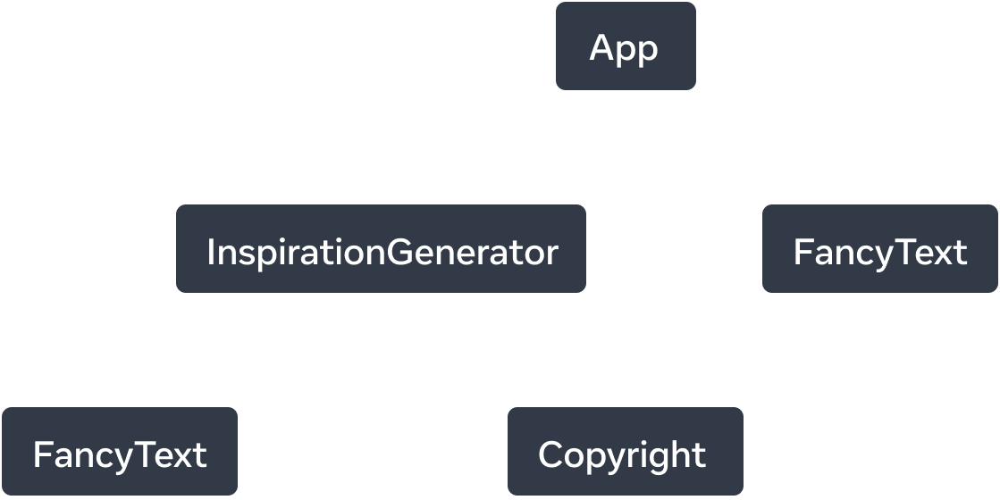
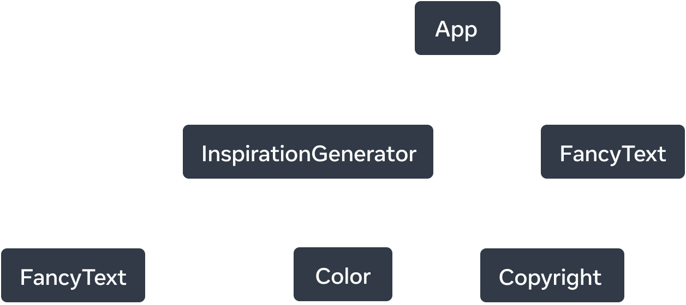

# UI AS A TREE
* Your React app is taking shape with many components being nested within each other
* React, and many other UI libraries, model UI as a tree.
* browsers use tree structures to model HTML (DOM) and CSS (CSSOM). 


* useful tools to understand how data flows through a React app


# the render tree = ui tree
* Top parent = "root" always
```jsx
return (
    <>
      <FancyText title text="Get Inspired App" />
      <InspirationGenerator>
        <Copyright year={2004} />
      </InspirationGenerator>
    </>
  );
  ```
* For smth like this the tree would be like

* render tree ONly has react components NOT HTML TAGS
*  With conditional rendering, a parent component may render different children depending on the data passed. (tree changes acc to condition)
* If parent component has a change all the sub tree rerenders hence, leaf components are the most rerendered


# module dependency tree
* a tree that represents the modules and their imports
* go by acc to the code and draw the tree
* App.js's childs are whatever app.js is importing and so on


* useful to determine what modules are necessary to run your React app
*  bundlers(tools that are responsible for clubbing all req js files and send it to client?) will use the dependency tree to determine what modules should be included.