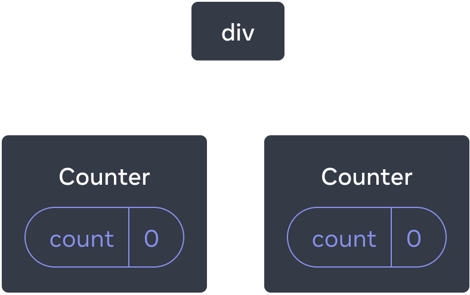
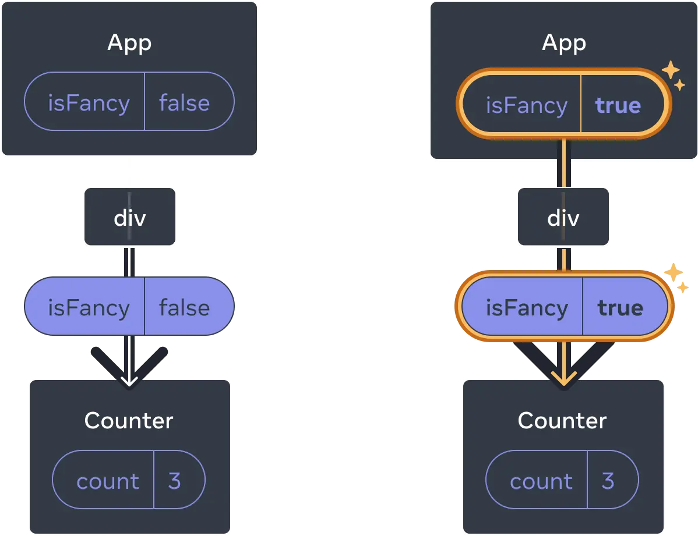
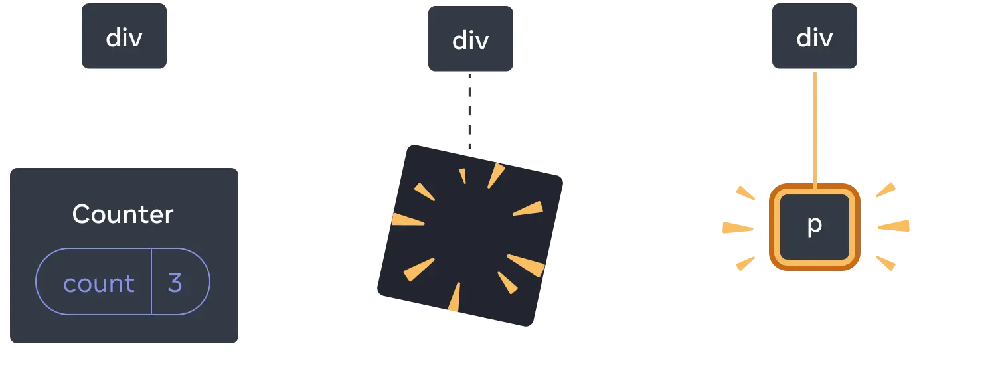

# Preserving and Resetting State
* State is isolated between components. 
* React keeps track of which state belongs to which component based on their place in the UI tree. 
* **You can control when to preserve state and when to reset it between re-renders.**
* React Puts the state in the UI tree (render tree) where it's owner (component) is residing

```jsx
import { useState } from 'react';

export default function App() {
  const counter = <Counter />;
  return (
    <div>
      {counter}
      {counter}
    </div>
  );
}

function Counter() {
  const [score, setScore] = useState(0);
  const [hover, setHover] = useState(false);

  let className = 'counter';
  if (hover) {
    className += ' hover';
  }

  return (
    <div
      className={className}
      onPointerEnter={() => setHover(true)}
      onPointerLeave={() => setHover(false)}
    >
      <h1>{score}</h1>
      <button onClick={() => setScore(score + 1)}>
        Add one
      </button>
    </div>
  );
}

```
* as we said, components are isolated.. so each counter has it's own state(own events hover, click etc) and each counter has it's own position in the render tree as well
* AND THE UI TREE LOOKS LIKE THIS



## react destroys state of a component as soon it is cut off from the render tree
```jsx
import { useState } from 'react';

export default function App() {
  const [showB, setShowB] = useState(true);
  return (
    <div>
      <Counter />
      {showB && <Counter />} 
      <label>
        <input
          type="checkbox"
          checked={showB}
          onChange={e => {
            setShowB(e.target.checked)
          }}
        />
        Render the second counter
      </label>
    </div>
  );
}

function Counter() {
  const [score, setScore] = useState(0);
  const [hover, setHover] = useState(false);

  let className = 'counter';
  if (hover) {
    className += ' hover';
  }

  return (
    <div
      className={className}
      onPointerEnter={() => setHover(true)}
      onPointerLeave={() => setHover(false)}
    >
      <h1>{score}</h1>
      <button onClick={() => setScore(score + 1)}>
        Add one
      </button>
    </div>
  );
}
```
* notice the check box? First increement the second button and uncheck the box and then check it again
* you will see count set to zero
* which means... when u unchecked the checkbox.. The component is cut off from the render tree soo the state is also destroyed
* when u check it again.. A new fresh counter component is added to the tree
* **React preserves a component’s state for as long as it’s being rendered at its position in the UI tree.**
* `Now reverse the components.. like Add ShowB && counter to first and leave 2nd as just counter.. Now u might assume.. When I hide the 1st, 2nd comes to first place and react might preserver state of prev and put it in new 1st BUT NO.. cuz.. It is not like the example below.. and the prev second comp   has it's own state defined and the prev first will be CUT OFF and it's state will be destroyed`

# BUT PRESERVING STATE?
```jsx
export default function App() {
  const [isFancy, setIsFancy] = useState(false);
  return (
    <div>
      {isFancy ? (
        <Counter isFancy={true} /> 
      ) : (
        <Counter isFancy={false} /> 
      )}
      <label>
        <input
          type="checkbox"
          checked={isFancy}
          onChange={e => {
            setIsFancy(e.target.checked)
          }}
        />
        Use fancy styling
      </label>
    </div>
  );
}

function Counter({ isFancy }) {
  const [score, setScore] = useState(0);
  const [hover, setHover] = useState(false);

  let className = 'counter';
  if (hover) {
    className += ' hover';
  }
  if (isFancy) {
    className += ' fancy';
  }

  return (
    <div
      className={className}
      onPointerEnter={() => setHover(true)}
      onPointerLeave={() => setHover(false)}
    >
      <h1>{score}</h1>
      <button onClick={() => setScore(score + 1)}>
        Add one
      </button>
    </div>
  );
}
```
* see in the `<div>` it is clearly showing two COunter components based on the isFancy state
* BUT, documentation says that.. No matter what isFancy iss.. In both situations counter is the first child of <div> so state doesn't change??
* Try checking and checking the checkbox.. the count doesn't change
* **WHYYYYYYYY???**





# POSITION MATTERS NOT THE MARKUP
* Remember that it’s the position in the UI tree—not in the JSX markup—that matters to React!
* Let's see.. the above code literally means.. there are two returns based on `isFancy` state.
```jsx
import { useState } from 'react';

export default function App() {
  const [isFancy, setIsFancy] = useState(false);
  if (isFancy) {
    return (
      <div>
        <Counter isFancy={true} />
        <label>
          <input
            type="checkbox"
            checked={isFancy}
            onChange={e => {
              setIsFancy(e.target.checked)
            }}
          />
          Use fancy styling
        </label>
      </div>
    );
  }
  return (
    <div>
      <Counter isFancy={false} />
      <label>
        <input
          type="checkbox"
          checked={isFancy}
          onChange={e => {
            setIsFancy(e.target.checked)
          }}
        />
        Use fancy styling
      </label>
    </div>
  );
}

function Counter({ isFancy }) {
  const [score, setScore] = useState(0);
  const [hover, setHover] = useState(false);

  let className = 'counter';
  if (hover) {
    className += ' hover';
  }
  if (isFancy) {
    className += ' fancy';
  }

  return (
    <div
      className={className}
      onPointerEnter={() => setHover(true)}
      onPointerLeave={() => setHover(false)}
    >
      <h1>{score}</h1>
      <button onClick={() => setScore(score + 1)}>
        Add one
      </button>
    </div>
  );
}
```

* You might expect the state to reset when you tick checkbox, but it doesn’t! 
* This is because both of these <Counter /> tags are rendered at the same position. 
* React doesn’t know where you place the conditions in your function. **All it “sees” is the tree you return.**
* In both cases, the App component returns a <div> with <Counter /> as a first child. 
* So to react, the two components have the same Address
* That's How react matches them up between previous and next renders.

* **what if instead of 2 same components, u have diff components**
# diff components at the same position resets state
```jsx
import { useState } from 'react';

export default function App() {
  const [isPaused, setIsPaused] = useState(false);
  return (
    <div>
      {isPaused ? (
        <p>See you later!</p> 
      ) : (
        <Counter /> 
      )}
      <label>
        <input
          type="checkbox"
          checked={isPaused}
          onChange={e => {
            setIsPaused(e.target.checked)
          }}
        />
        Take a break
      </label>
    </div>
  );
}

function Counter() {
  const [score, setScore] = useState(0);
  const [hover, setHover] = useState(false);

  let className = 'counter';
  if (hover) {
    className += ' hover';
  }

  return (
    <div
      className={className}
      onPointerEnter={() => setHover(true)}
      onPointerLeave={() => setHover(false)}
    >
      <h1>{score}</h1>
      <button onClick={() => setScore(score + 1)}>
        Add one
      </button>
    </div>
  );
}

```


* before it was the same `<Counter />`
* but now.. it changes soo the state resets
* in the render tree the structure changes from Counter to <p>.. the counter gets destroyed so is it's state.
* **when you render a different component in the same position, it resets the state of its entire subtree.**
```jsx
<div>
{isFancy ? (
        <div>
          <Counter isFancy={true} /> 
        </div>
      ) : (
        <section>
          <Counter isFancy={false} />
        </section>
      )}
</div>
```
* the entire subtree of 2nd <div> and <section> gets reset everytime
* `As a rule of thumb, if you want to preserve the state between re-renders, the structure of your tree needs to “match up” from one render to another`
* If the structure is different, the state gets destroyed 

* **WHICH IS WHY U SHOULD NOT NEST COMPONENT `DEFINITIONS`**


# resetting state at same position
* we have 2 ways
        * render components in different positions
        * give each component an explicit identity called `key`
## render comps in diff positions
```jsx
{isPlayerA &&
        <Counter person="Taylor" />
      }
      {!isPlayerA &&
        <Counter person="Sarah" />
      }
```
* this creates 2 independent Counters 
## resetting with a key
* same as `key` in rendering list items, we can use the same to COmponents
* By default, React uses order within the parent (“first counter”, “second counter”) to discern between components.
* But Keys help with specific identity
```jsx
import { useState } from 'react';

export default function Scoreboard() {
  const [isPlayerA, setIsPlayerA] = useState(true);
  return (
    <div>
      {isPlayerA ? (
        <Counter key="Taylor" person="Taylor" />
      ) : (
        <Counter key="Sarah" person="Sarah" />
      )}
      <button onClick={() => {
        setIsPlayerA(!isPlayerA);
      }}>
        Next player!
      </button>
    </div>
  );
}

function Counter({ person }) {
  const [score, setScore] = useState(0);
  const [hover, setHover] = useState(false);

  let className = 'counter';
  if (hover) {
    className += ' hover';
  }

  return (
    <div
      className={className}
      onPointerEnter={() => setHover(true)}
      onPointerLeave={() => setHover(false)}
    >
      <h1>{person}'s score: {score}</h1>
      <button onClick={() => setScore(score + 1)}>
        Add one
      </button>
    </div>
  );
}
```
* See, If there is no key.. The state must have been preserved even if u switch players as the position of <Counter /> remains same in the tree
* BUT, when u specify key.. u r already saying.. they both are different in position
* SO The both COunters are at diff positions .. after each switch the prev one gets CUTTING OFF destroying it's state as well
* SO state resets every time

```jsx
import { useState } from 'react';
import Chat from './Chat.js';
import ContactList from './ContactList.js';

export default function Messenger() {
  const [to, setTo] = useState(contacts[0]);
  return (
    <div>
      <ContactList
        contacts={contacts}
        selectedContact={to}
        onSelect={contact => setTo(contact)}
      />
      <Chat key={to.id} contact={to} />
    </div>
  )
}

const contacts = [
  { id: 0, name: 'Taylor', email: 'taylor@mail.com' },
  { id: 1, name: 'Alice', email: 'alice@mail.com' },
  { id: 2, name: 'Bob', email: 'bob@mail.com' }
];
```

# Preserving state for removed components 

https://react.dev/learn/preserving-and-resetting-state#preserving-state-for-removed-components

